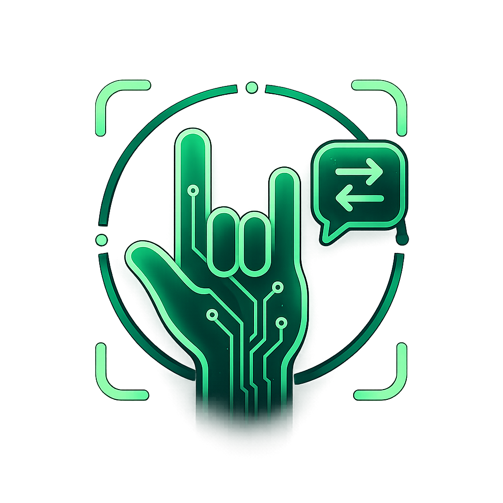

# HearMySign — Sign Language Communication App

<p align="center">
  
</p>

<p align="center">
  
  
  
  
  
  
</p>

> A video calling app built for the deaf community — with real-time ASL sign recognition, completely free peer-to-peer video calls, and full Arabic/multilingual support.

---

## What This App Does

- **Free video calls** — peer-to-peer WebRTC, no cost per call
- **Live ASL recognition** — AI reads hand signs during a call and shows the detected letter on screen
- **Word recognition** — sign a full word (30-frame sequence) and the AI predicts it
- **Chat & messaging** — direct messages, presence indicators, unread badges
- **Full multilingual UI** — English, Arabic (RTL), Spanish, French
- **Secure auth** — email + phone SMS OTP + optional 2FA (TOTP authenticator app)

---

## How the AI is Connected — No IP Address Needed

The ASL recognition model runs as a Python/TensorFlow server. Instead of using an IP address, it runs under a **free custom domain** (`asl.servepics.com`) — a free dynamic DNS service. Anyone with the domain name can reach the server without knowing any IP.

```
Phone (Flutter app)
      │  HTTP to asl.servepics.com:8000
      ▼
Free dynamic DNS domain (asl.servepics.com)
      │
      ▼
Python AI server (runs on any machine at home or anywhere)
TensorFlow · MediaPipe · EfficientNetB0
```

- **No IP needed** — the domain always points to the right machine
- **No cloud server cost** — runs on your own machine
- **No port forwarding complexity** — domain handles routing
- The app sends video frames to `asl.servepics.com/api/predict` during a call
- The server returns the detected ASL letter and confidence score
- The letter appears as an overlay on the call screen

---

## Free Video Calls — How

Video calls use **WebRTC** — a peer-to-peer protocol. Once the call connects, audio and video travel **directly between the two phones** with no paid relay server.

```
Phone A ─────────────────────────────── Phone B
         direct peer-to-peer stream
              (WebRTC, free)

    Firebase Firestore
 (signaling only: "call me",
  "accept", "hang up" — tiny data)

    TURN server (asl.servepics.com:3478)
 (self-hosted fallback for strict networks,
  uses HMAC time-limited credentials — free)
```

- **No per-minute cost** — the video/audio stream is direct between phones
- **Firebase** is only used for the call handshake (a few bytes of signaling data)
- **TURN relay** is self-hosted on the same machine as the AI server — no third-party cost

---

## Full Feature List

### Authentication
- Email + password login and signup
- Phone number verification via SMS OTP
- Two-factor authentication — TOTP (Microsoft Authenticator, Google Authenticator)
- Mandatory password change (admin-enforced on next login)
- Forgot password — email reset link

### Video & Voice Calls
- Free peer-to-peer WebRTC video calls
- Voice-only calls
- Incoming call notification — works when app is in background
- Live ASL letter overlay on the call screen (AI recognition during call)
- **Real-time ASL translation to remote user** — signed letters appear on the other person's screen via WebRTC data channel
- Scanning indicator when ASL is active but no hand detected yet
- Self-hosted TURN relay for fallback (no external cost)

### ASL Recognition (during call)
- **Letter mode** — detects hand signs in real time, returns A–Z with confidence
- **Word mode** — buffers 30 frames of hand landmarks, predicts the full word
- **MediaPipe hand detection** — crops the hand automatically, works on any background
- Landmark-based model (person/lighting invariant) with CNN fallback
- Live tester web page served by the AI server (Letters · Words · Quiz · Upload tabs)

### Chat & Messaging
- Direct messages between friends
- Real-time delivery via Firestore streams
- Unread message badge on bottom navigation
- In-app banner when a message arrives while the app is open

### Friends & Contacts
- Add friends by username
- Friend request system — send, accept, reject
- Pending request badge counter
- Contacts auto-synced from friendships

### Settings
- **Language** — English, Arabic (full RTL), Spanish, French
- **Theme** — Dark / Light mode
- **Profile** — display name, username, profile photo (Cloudinary upload)
- **Change password**
- **Authenticator app** — set up TOTP, enable / disable / remove
- **Status** — Online / Idle / Do Not Disturb / Offline

### App Infrastructure
- OTA (over-the-air) update — AI server serves the latest APK at `/api/apk`; app checks `/api/version` on launch and prompts user to update
- Splash screen
- Push notifications (local)
- Presence indicators on all avatars

---

## AI Model Status

| Feature | Status |
|---|---|
| Letter / alphabet recognition | ✅ **98.86% test accuracy** — GPU-trained on 333K landmarks |
| Word recognition | 🔧 In progress — model trains, accuracy improving |
| Language-aware output (Arabic letters for Arabic users) | 📋 Planned — after AI is solid |

**Stack:** Python · TensorFlow 2.18 · MediaPipe · NVIDIA GPU (GTX 1650 Ti)  
**Training data:** 333,698 hand landmarks (5 Kaggle datasets + original data)  
**Augmentation:** Gaussian jitter · rotation ±15° · scale ±10% (applied every epoch on GPU)  
**Server:** Python `ThreadingHTTPServer` on port 8000  
**Domain:** `asl.servepics.com` (free NO-IP dynamic DNS — no IP, no cost)  
**TURN:** Self-hosted coturn at `asl.servepics.com:3478` (HMAC credentials, 1h TTL)

---

## Architecture

```
┌──────────────────────────────────────────────┐
│           Flutter Mobile App                 │
│                                              │
│  Firebase Auth   Firestore   Cloudinary      │
│                                              │
│  Video Calls ── WebRTC (peer-to-peer)        │
│       │  fallback ──► TURN (self-hosted)     │
│       │                                      │
│       │ HTTP frames  (asl.servepics.com:8000)│
└───────┼──────────────────────────────────────┘
        │
        ▼  free dynamic DNS — no IP needed
┌──────────────────────────────────────────────┐
│   Python AI Server  (any machine)            │
│   TensorFlow · EfficientNetB0 · MediaPipe    │
│                                              │
│   /api/predict      → letter + confidence    │
│   /api/predict_word → word  + confidence     │
│   /api/turn         → TURN credentials       │
│   /api/version      → OTA version check      │
│   /api/apk          → serves latest APK      │
│   /                 → live web tester        │
└──────────────────────────────────────────────┘
```

---

## Project Structure

```
sign_language_app/                      Flutter app
├── lib/
│   ├── core/
│   │   ├── l10n/app_strings.dart       all UI text — EN / AR / ES / FR
│   │   └── theme/                      dark/light theme + locale provider
│   ├── controllers/                    business logic per feature
│   ├── models/                         data models
│   ├── screens/
│   │   ├── auth/                       login · signup · 2FA · password change
│   │   ├── calls/                      video call screen + ASL letter overlay
│   │   ├── chat/                       DMs · conversation · friends
│   │   ├── communication/              contacts + calls tabs
│   │   ├── home/                       bottom nav shell · notification handling
│   │   └── settings/                   settings · profile info
│   └── services/
│       ├── asl_service.dart            sends frames → AI server, reads letter back
│       ├── server_config.dart          stores AI server URL (hidden from settings UI)
│       ├── turn_service.dart           fetches TURN credentials from AI server
│       └── …

new_asl_tensorflow_project/             AI training + server
├── webapp/server.py                    Python HTTP server (letters + words + web tester)
├── webapp/hand_detect.py               MediaPipe hand detection subprocess
├── training/train.py                   resumable training
├── inference/predict_image.py          CNN letter prediction
├── inference/predict_landmark.py       landmark-based letter prediction
├── inference/predict_word.py           LSTM word sequence prediction
└── models/                             saved checkpoints
```

---

## Getting Started

```bash
git clone https://github.com/ZyadMohamedVa/sign-lang-app.git
cd sign-lang-app
git checkout asl-public-api
cd sign_language_app
flutter pub get
flutter run
```

> You need `google-services.json` in `android/app/` — get it from Firebase console (not committed to repo).

### Running the AI Server

```bash
cd new_asl_tensorflow_project
python webapp/server.py --port 8000
```

The web tester opens at `http://localhost:8000` — Letters, Words, Quiz, and Upload tabs.

---

## AI Server API Reference

Base URL: `http://asl.servepics.com:8000`

---

### `POST /api/predict` — Predict Letter from Image

Send a video frame, get back the detected ASL letter.

**Request**
```json
{
  "image_base64": "<base64-encoded JPEG/PNG — raw or data:image/jpeg;base64,... both work>"
}
```

**Response**
```json
{
  "predicted_class": "A",
  "confidence": 0.97,
  "hand_detected": true,
  "model_used": "landmarks",
  "crop_b64": "<base64 JPEG of the cropped hand — what the model actually saw>",
  "norm_landmarks": [
    [0.12, 0.45, 0.01],
    [0.15, 0.48, 0.02],
    "... 21 landmarks × [x, y, z] — normalized 0–1"
  ],
  "top_k": [
    { "class_name": "A", "confidence": 0.97 },
    { "class_name": "S", "confidence": 0.02 },
    { "class_name": "E", "confidence": 0.01 }
  ]
}
```

| Field | Description |
|---|---|
| `predicted_class` | The detected letter (A–Z) |
| `confidence` | 0.0 – 1.0 |
| `hand_detected` | `true` if MediaPipe found a hand, `false` = used full image |
| `model_used` | `"landmarks"` (better, person-invariant) or `"cnn"` (fallback) |
| `crop_b64` | What the model actually saw — useful for debugging |
| `norm_landmarks` | 21 hand landmarks × [x,y,z] — use these to build word sequences |
| `top_k` | Top 3 predictions with confidence scores |

> **How the Flutter app uses this:** `asl_service.dart` calls this every frame during a call. The returned letter is shown as an overlay. The `norm_landmarks` are buffered to build word sequences.

---

### `POST /api/predict_word` — Predict Word from Landmark Sequence

Send 30 frames of hand landmarks, get back the predicted word.

**Request**
```json
{
  "sequence": [
    [0.12, 0.45, 0.01,  0.15, 0.48, 0.02,  "... 63 floats (21 landmarks × 3 coords, flattened)"],
    "... 30 frames total"
  ]
}
```

Each frame is a flat array of **63 floats** — take `norm_landmarks` from `/api/predict`, flatten each `[x,y,z]` triplet.

**Response**
```json
{
  "predicted_class": "hello",
  "confidence": 0.84,
  "top_k": [
    { "class_name": "hello", "confidence": 0.84 },
    { "class_name": "help",  "confidence": 0.10 },
    { "class_name": "how",   "confidence": 0.06 }
  ]
}
```

**503** — word model not trained yet (returns `{ "error": "Word model not available" }`)

> **How to collect 30 frames:** Call `/api/predict` at ~10 fps. Each time `norm_landmarks` is returned, push it to a buffer. When buffer reaches 30, send to `/api/predict_word`. Slide the buffer by 15 (half) after each prediction.

---

### `GET /api/turn` — Get TURN Server Credentials

Returns WebRTC ICE server config with time-limited HMAC credentials (1 hour TTL). Called by the Flutter app before each call.

**Response**
```json
{
  "iceServers": [
    { "urls": "stun:stun.l.google.com:19302" },
    {
      "urls": [
        "turn:asl.servepics.com:3478?transport=udp",
        "turn:asl.servepics.com:3478?transport=tcp"
      ],
      "username":   "1234567890:hearmysign",
      "credential": "<HMAC-SHA1 base64>"
    }
  ]
}
```

---

### `GET /api/version` — OTA Version Check

The Flutter app calls this on launch to check if a new APK is available.

**Response**
```json
{
  "version": "1.1.0",
  "apk_url": "http://asl.servepics.com:8000/api/apk"
}
```

If `version` differs from the app's built-in version (`kAppVersion` in `main.dart`), the app shows an update prompt.

---

### `GET /api/apk` — Download Latest APK

Serves the APK file for OTA install. Place your built APK at `/home/yassin/sign_language_app.apk` on the server machine.

**Response:** binary APK file (`application/vnd.android.package-archive`)

---

### `GET /health` — Health Check

**Response**
```json
{ "status": "ok", "mediapipe": true }
```

`mediapipe: true` means hand detection is active. `false` means the server falls back to full-image CNN prediction.

---

### `GET /` — Live Web Tester

Opens a browser UI to test the model directly in the browser:
- **Letters** — live camera, predicts letter every 0.8s
- **Words** — buffers 30 frames and predicts the word

---

### Error Responses

All errors return JSON:
```json
{ "error": "description of what went wrong" }
```

| HTTP code | Meaning |
|---|---|
| 400 | Bad request — missing or malformed `image_base64` / `sequence` |
| 404 | Endpoint not found |
| 503 | Model not loaded (word model not trained yet) |

---

## Active Branch

All development is on **`asl-public-api`**. This is the only branch with the full app + AI integration. Do not use `main` or `video-call`.
